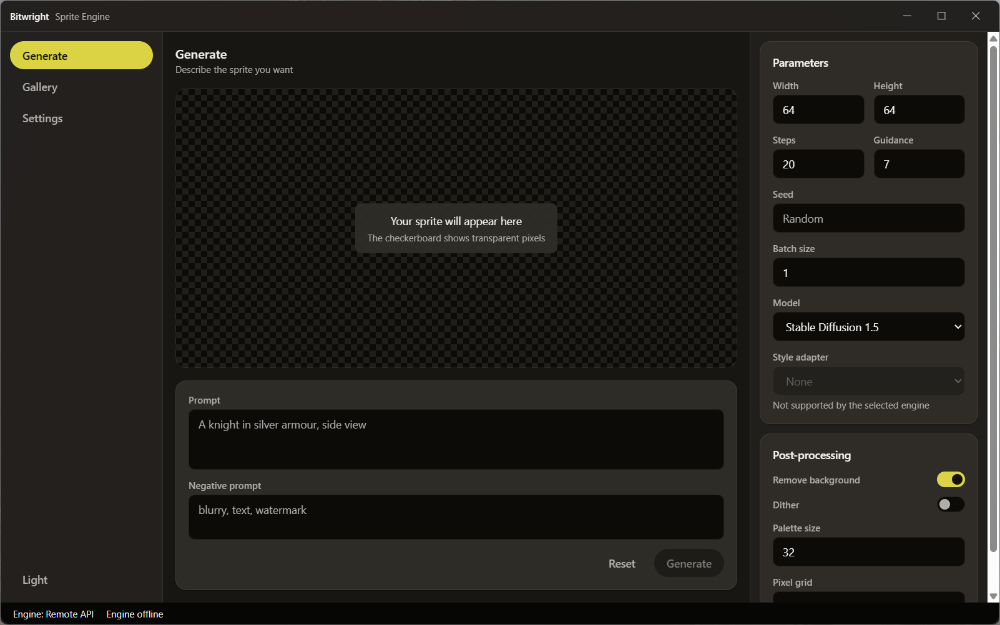

# Bitwright - Sprite Engine

Cross-platform sprite generation engine for pixel art games.

[](https://github.com/Afterhours-Studio/bitwright-sprite-engine/blob/main/LICENSE)
[](https://github.com/Afterhours-Studio/bitwright-sprite-engine/actions/workflows/ci.yml)
[](https://github.com/Afterhours-Studio/bitwright-sprite-engine/actions/workflows/license-check.yml)
[](https://github.com/Afterhours-Studio/bitwright-sprite-engine/releases)
[](https://github.com/Afterhours-Studio/bitwright-sprite-engine/blob/main/docs/getting-started/system-requirements.md)

Bitwright is a desktop application that generates pixel art character sprites
with a diffusion model. Generation runs on a local GPU, or through a remote
inference API, whichever you choose in Settings.



<details>
<summary><b>More screenshots</b></summary>

| | Dark | Light |
| --- | --- | --- |
| Generate | [view](docs/assets/screenshots/generate-dark.png) | [view](docs/assets/screenshots/generate-light.png) |
| Gallery | [view](docs/assets/screenshots/gallery-dark.png) | [view](docs/assets/screenshots/gallery-light.png) |
| Settings | [view](docs/assets/screenshots/settings-dark.png) | [view](docs/assets/screenshots/settings-light.png) |

Captured on Windows 11. The backends are stubs in this release, so the canvas
shows the empty state rather than a generated sprite.

</details>

## Table of contents

- [Features](#features)
- [Installation](#installation)
- [Quick start](#quick-start)
- [Configuration](#configuration)
- [Development](#development)
- [Architecture](#architecture)
- [Roadmap](#roadmap)
- [Contributing](#contributing)
- [License](#license)

## Features

- Generates pixel art sprites from a text prompt.
- Runs on your own GPU or through a remote API. You choose; the application
  never falls back to a remote service on its own.
- NVIDIA (CUDA), Apple Silicon (Metal), and remote HTTP endpoints.
- Post-processing built for sprites: background removal, palette quantization,
  pixel grid snapping, and sprite sheet packing.
- Engines declare what they support, and the interface disables the rest, so an
  option is never offered that was always going to fail.
- Windows, macOS, and Linux, from one codebase.
- English and Vietnamese, with a translation system that fails the build when a
  key is missing from either.
- Dark and light themes, with contrast and elevation verified in CI rather than
  by eye.
- No telemetry. Prompts stay on the machine unless you select a remote engine.
- The engine is authenticated and loopback only, so no other process on the
  machine can drive it, and a web page cannot reach it through DNS rebinding.

## Installation

Download from the [releases page](https://github.com/Afterhours-Studio/bitwright-sprite-engine/releases).
Full instructions, including what to do when the operating system blocks the
first launch, are in [the installation guide](docs/getting-started/installation.md).

<details>
<summary><b>Windows</b></summary>

Download and run `Bitwright_<version>_x64-setup.exe`.

SmartScreen may warn that the publisher is unrecognised, because pre-1.0 builds
are not code signed. Choose **More info**, then **Run anyway**.

The WebView2 runtime is required and installs automatically if missing. It ships
with Windows 11 and current Windows 10.

</details>

<details>
<summary><b>macOS</b></summary>

Download `Bitwright_<version>_universal.dmg`, open it, and drag Bitwright to
Applications.

The first launch is blocked, because pre-1.0 builds are not notarised. Open
**System Settings**, then **Privacy & Security**, and choose **Open Anyway**.

Local generation needs Apple Silicon. An Intel Mac runs the application against
a remote API.

</details>

<details>
<summary><b>Linux</b></summary>

```bash
# AppImage
chmod +x Bitwright_0.0.2_amd64.AppImage
./Bitwright_0.0.2_amd64.AppImage

# Debian and Ubuntu
sudo apt install ./bitwright_0.0.2_amd64.deb

# Fedora
sudo dnf install ./bitwright-0.0.2-1.x86_64.rpm
```

If the window does not open, install the WebKit runtime:

```bash
sudo apt install libwebkit2gtk-4.1-0   # Debian and Ubuntu
sudo dnf install webkit2gtk4.1         # Fedora
```

</details>

No model weights are included in any download. The first generation fetches the
model you selected, under its own licence. See [MODELS.md](MODELS.md).

## Quick start

1. Open **Settings**, then **Engine**. Every engine is listed with its
   availability, and an unavailable one says why. Press **Use this engine** on
   the one you want.
2. Open **Generate** and write a prompt:

   ```
   a knight in silver armour, side view, idle pose
   ```

3. Leave the size at 64 by 64 and the post-processing at its defaults.
4. Press **Generate**.

The first run on a local engine downloads the model, which is several gigabytes.
The result appears on the checkerboard canvas, which shows which pixels are
transparent.

To iterate, note the seed of a result you like, put it in the **Seed** field,
and change one parameter at a time.

More in [the quick start guide](docs/getting-started/quick-start.md).

## Configuration

Most settings are in the application. The engine also reads environment
variables, each prefixed `BITWRIGHT_`.

| Setting | Variable | Default | Meaning |
| --- | --- | --- | --- |
| Backend | `BITWRIGHT_BACKEND` | `auto` | `auto`, `cuda`, `mps`, or `remote` |
| Remote endpoint | `BITWRIGHT_REMOTE_ENDPOINT` | empty | Base URL of a remote API |
| Remote API key | `BITWRIGHT_REMOTE_API_KEY` | empty | Bearer token for that endpoint |
| Remote timeout | `BITWRIGHT_REMOTE_TIMEOUT_S` | `120` | Seconds to wait for a response |
| Model cache | `BITWRIGHT_CACHE_DIR` | per platform | Where weights are stored |
| Allow downloads | `BITWRIGHT_ALLOW_DOWNLOADS` | `true` | When false, a missing model is an error |
| Port | `BITWRIGHT_PORT` | `0` | Engine port. Zero asks for a free one |
| Log level | `BITWRIGHT_LOG_LEVEL` | `INFO` | Engine log level |

Full list, and the generation parameters, in
[the configuration reference](docs/reference/configuration.md).

## Development

Requires Node.js 20 or later, Python 3.11 or later, and a stable Rust
toolchain. Platform packages are listed in
[the setup guide](docs/development/setup.md).

```bash
git clone https://github.com/Afterhours-Studio/bitwright-sprite-engine.git
cd bitwright-sprite-engine

# Linux and macOS
./scripts/setup-dev.sh

# Windows (PowerShell)
./scripts/setup-dev.ps1

npm run tauri dev --workspace @bitwright/desktop
```

The setup script checks the prerequisites, installs both dependency sets, builds
the Python sidecar binary, and runs the checks.

<details>
<summary><b>Running the checks</b></summary>

```bash
# Frontend
npm run lint
npm run typecheck
npm run test
npm run format:check

# Colour tokens: elevation steps and contrast ratios
npm run check:contrast

# Engine
cd packages/engine
ruff format --check .
ruff check .
mypy .
pytest

# Shell
cd apps/desktop/src-tauri
cargo fmt --all --check
cargo clippy --all-targets -- -D warnings
cargo test

# Dependency licences
python scripts/check-licenses.py
```

CI runs all of these on Linux, Windows, and macOS.

</details>

<details>
<summary><b>Building a release</b></summary>

```bash
python scripts/build-sidecar.py
npm run tauri build --workspace @bitwright/desktop
```

Installers land in `apps/desktop/src-tauri/target/release/bundle/`.

</details>

<details>
<summary><b>Repository layout</b></summary>

```
apps/desktop/            React frontend and the Tauri shell
  src/                   Components, features, stores, hooks, locales
  src-tauri/             Rust: window, decorations, sidecar lifecycle
packages/engine/         Python engine, run as a sidecar process
  bitwright_engine/
    api/                 FastAPI application, routes, schemas
    backends/            The backend interface and its implementations
    pipeline/            Generation and post-processing
    models/              Model registry and download cache
docs/                    Guides, architecture, decision records
scripts/                 Setup, sidecar build, contrast and licence checks
```

</details>

## Architecture

Three processes, each in the language that suits its job:

```
React (webview)  --Tauri IPC-->  Rust shell  --spawn-->  Python sidecar
       |                                                       |
       +-------------------- loopback HTTP --------------------+
```

The Rust shell owns the window, the custom decorations, the platform background
effect, and the lifetime of the sidecar. The Python sidecar owns model loading,
generation, and post-processing, and exposes them over a loopback HTTP API. The
frontend talks to Rust about the window and to the sidecar about generation.

Every backend answers the same three questions, and nothing else in the
application knows how generation works: whether it can run here, what optional
features it supports, and how to generate.

Details in [the architecture overview](docs/architecture/overview.md), and the
reasoning in [the decision records](docs/architecture/decisions/0001-record-architecture-decisions.md).

## Roadmap

- [x] Backend abstraction with capability negotiation
- [x] CUDA, Apple Silicon, and remote API backends
- [x] Python sidecar with lifecycle management and graceful shutdown
- [x] Custom window decorations and platform background effects
- [x] Colour token system with contrast checks in CI
- [x] English and Vietnamese, with build-time parity checks
- [x] Token authentication on the engine, and no direct webview access to it
- [x] Orphan protection, so a crashed shell cannot leave the GPU held
- [ ] Real diffusion pipelines behind the backend stubs
- [ ] Model downloading, with the licence shown before the fetch
- [ ] ControlNet pose control
- [ ] IP-Adapter reference images
- [ ] Animation frames from a single reference sprite
- [ ] Sprite sheet export with engine-specific metadata
- [ ] A persistent gallery, with tags and search
- [ ] Signed and notarised builds

## Contributing

Contributions are welcome. Read [CONTRIBUTING.md](CONTRIBUTING.md) first: it
covers the workflow, the commit convention, the coding standards, and the rule
that a new string must exist in both locales.

Contributors sign a CLA that assigns copyright in the contribution to Afterhours
Studio. The reasoning is set out in
[CONTRIBUTING.md](CONTRIBUTING.md#contributor-license-agreement) and in
[decision 0004](docs/architecture/decisions/0004-agpl-license-choice.md).

Participation is covered by the [Code of Conduct](CODE_OF_CONDUCT.md). Security
issues go through [SECURITY.md](SECURITY.md), never a public issue.

## License

Licensed under the GNU Affero General Public License v3.0 only.

Copyright (C) 2026 Afterhours Studio. See [LICENSE](LICENSE) for the full text
and [NOTICE](NOTICE) for the notice.

Machine learning model weights are **not** part of this program and are not
covered by the AGPL. They are downloaded at first use and remain under their own
licences, some of which restrict how the output may be used. Read
[MODELS.md](MODELS.md) before generating anything you intend to ship.

Third party dependencies and their licences are listed in
[THIRD_PARTY_LICENSES.md](THIRD_PARTY_LICENSES.md), and checked in CI.

---

Built by [h1dr0n](https://github.com/h1dr0nn) at
[Afterhours Studio](https://github.com/Afterhours-Studio).
