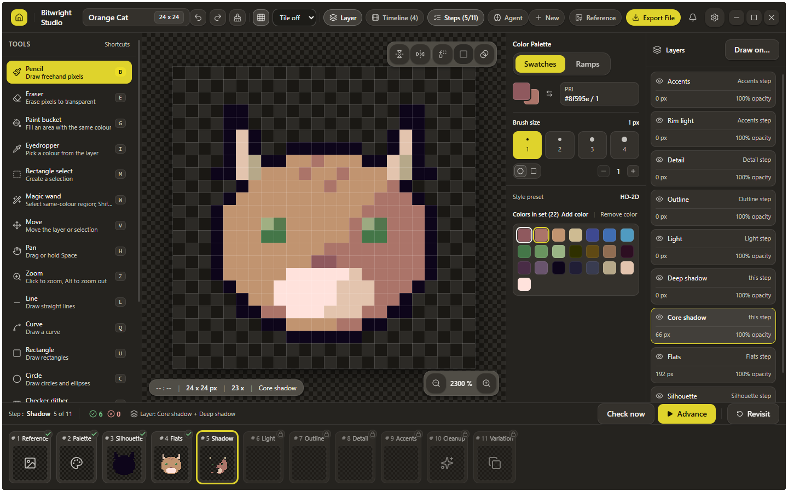
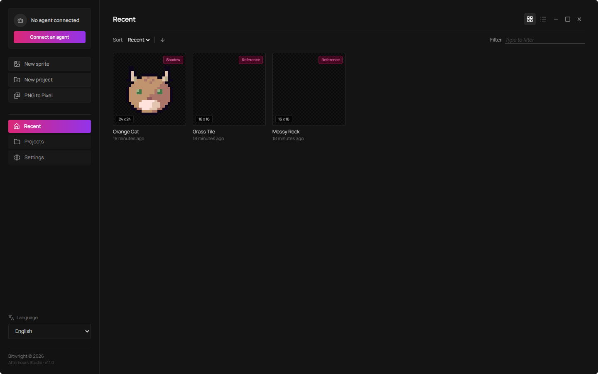
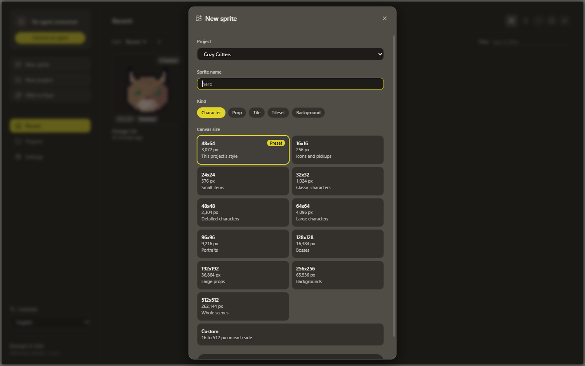

# Bitwright - Sprite Engine

Agent-driven pixel art editor for games.

[](https://github.com/Afterhours-Studio/bitwright-sprite-engine/blob/main/LICENSE)
[](https://github.com/Afterhours-Studio/bitwright-sprite-engine/actions/workflows/ci.yml)
[](https://github.com/Afterhours-Studio/bitwright-sprite-engine/actions/workflows/license-check.yml)
[](https://github.com/Afterhours-Studio/bitwright-sprite-engine/releases)
[](https://github.com/Afterhours-Studio/bitwright-sprite-engine/blob/main/docs/getting-started/system-requirements.md)

Bitwright is a desktop pixel art editor whose canvas an MCP client — an AI agent
— drives. The document is indexed: every pixel is a palette slot, so a layer
reads back as text and an agent can see exactly what it drew. Layers are the
workflow steps of a sprite — silhouette, flats, shadow-core, shadow-deep, light,
outline, detail, rim, accent — and each step has a gate measured from the pixels
rather than asserted by the agent. The engine chooses the shading colours; the
agent places them.

## Table of contents

- [Features](#features)
- [Installation](#installation)
- [Quick start](#quick-start)
- [Configuration](#configuration)
- [Development](#development)
- [Architecture](#architecture)
- [Roadmap](#roadmap)
- [Contributing](#contributing)
- [License](#license)

## Features



### The studio

The interface is one window with three screens: home, the editor and
Settings. There is no separate title bar. The top row of each screen is what
you drag the window by, and it carries the window buttons at its end.



- **Home** is where Bitwright opens. The sidebar has the agent card (whether
  an agent is connected, and a button to Settings to connect one), the create
  actions **New sprite**, **New project** and **PNG to Pixel**, and the
  sections **Recent**, **Projects** and **Settings**, with the language picker
  at the bottom. The content area shows your sprites as a grid of thumbnails
  or as a list, sorted by recency, name, size or kind and filtered by name.
  Each card shows the sprite's size and the workflow step it has reached.
  **Projects** groups the same sprites under one heading per project, which is
  where a project is renamed or deleted and its style preset shown.
- **New sprite** asks for the project, a name, the kind (character, prop,
  tile, tileset or background) and a size: a square from 16 to 512 pixels,
  the project preset's size, or a custom width and height. The size is fixed
  once the sprite exists, because every layer and every recorded edit is
  measured in it.
- **PNG to Pixel** picks a picture, creates a sprite for it in the selected
  project, and imports the picture as that sprite's reference, so you start
  drawing against it straight away.
- **The editor** has a header across the top, the tools column on the left,
  the stage in the middle, the colour panel and the layers panel on the right,
  and the steps strip along the bottom. The layers panel and the steps strip
  can each be hidden from the header.
- **The header** holds the home button, the sprite's name (renamed in place)
  and its size, undo, redo and clear the active layer, the pixel grid and a
  tile guide of 8 to 64 pixels, the **Layer**, **Steps** and **Agent**
  toggles, then **New**, **Reference**, **Export File**, notifications and
  Settings.
- **The stage** shows the sprite over a checkered workspace. Flip, replace
  secondary with primary, outline and anti-alias sit at the top right; the
  cursor position, size, zoom and target layer at the bottom left; the zoom
  control at the bottom right. A background asset shows the tilemap editor
  here instead.
- **The colour panel** shows the primary and secondary colours, the brush size
  (1 to 16 pixels, round or square), the project's style preset, and the
  palette as swatches or as ramps. Left click on a swatch picks the primary
  colour, right click the secondary.
- **The layers panel** lists the layers the workflow defines, top first, with
  visibility, the step that owns each one and its pixel count. There is no
  free "add layer", because each layer belongs to a step. **Draw on…** sends
  strokes to a layer other than the current step's.
- **The command palette**, `Ctrl+K` (`Cmd+K` on macOS), reaches every screen,
  view toggle, tool, theme and language from the keyboard.



### Drawing by hand

Sixteen tools, each on a single key. The letters are Aseprite's wherever
Aseprite has the tool, so the habits most pixel artists already have carry
over.

| Tool             | Key | What it does                                                    |
| ---------------- | --- | --------------------------------------------------------------- |
| Pencil           | B   | Draw freehand pixels                                            |
| Eraser           | E   | Erase pixels to transparent                                     |
| Paint bucket     | G   | Fill an area of the same colour                                 |
| Eyedropper       | I   | Pick the primary colour from the layer; right click: secondary  |
| Rectangle select | M   | Select a rectangle                                              |
| Magic wand       | W   | Select a contiguous same-colour region; Shift: every such pixel |
| Move             | V   | Move the layer, or the selected pixels                          |
| Pan              | H   | Drag the view; Space held pans with any tool                    |
| Zoom             | Z   | Click to zoom in, Alt click to zoom out                         |
| Line             | L   | Draw a straight line                                            |
| Curve            | Q   | Draw a curve                                                    |
| Rectangle        | U   | Draw a rectangle, outlined or filled                            |
| Circle           | C   | Draw a circle or an ellipse, outlined or filled                 |
| Checker dither   | J   | Paint the primary and secondary colours in a checker            |
| Lighten          | O   | Step each pixel one colour lighter along its ramp               |
| Darken           | K   | Step each pixel one colour darker along its ramp                |

- A selection clips every tool, so you can paint, fill or clear inside it
  without touching the pixels around it. `Delete` clears what it holds, and
  `Escape` drops it.
- Mirror symmetry, under the tool list, repeats each stroke about the canvas
  centre horizontally, vertically or both.
- Your strokes and an agent's tool calls end in the same buffer and the same
  undo history. Each stroke is one entry, and undo does not care who made it.

The other keys are in [Keyboard shortcuts](#keyboard-shortcuts).

### Drawing with an agent

- An MCP client drives the canvas, and you watch it draw. The stage shows
  "Agent drawing · <tool>" while a tool call is in flight, and an `open_asset`
  call switches the window to the asset the agent is working on.
- The header's **Agent** button opens a popover with the MCP server's state and
  address, the connected sessions and the last tool each one called, and a
  shortcut to the client configuration in Settings.
- Indexed document: pixels are palette slots, so a 64 by 64 layer reads back as
  sixty-four lines of sixty-four characters with rulers, and an agent can count
  to the pixel it means.
- Layers are the workflow steps. Each step writes its own layer, so revising the
  shading does not destroy the detail pass.
- Gates are computed from the pixel buffer. A silhouette that is two
  disconnected regions does not pass, whatever the agent says about it.
- The engine chooses shading colours; the agent places them. No tool accepts a
  hex value for shading.
- The steps strip along the bottom of the editor is the workflow: one card per
  step, from Reference to Variation, each with a thumbnail of its layer and a
  mark for done or not reached yet. Its bar names the current step and its
  layer, summarises the gate report (open it for the detail), and carries
  **Check** and **Advance**. Revisiting a step that already passed only moves
  you back to it — nothing is erased, every layer stays — and forcing an
  advance past one that failed its gate is recorded in the op log as forced.
  Both ask for confirmation first.
- The MCP server runs inside the application, with two transports: **HTTP
  Local**, a loopback endpoint with a bearer token, and **stdio**, for clients
  that spawn the process themselves.
- Settings → **Agent connection** card: transport, status, URL with copy, token
  (masked, with Reveal, Copy and Regenerate), connected sessions, one row per
  client (Claude Code, Claude Desktop, Cursor) with Register and Remove,
  **Configure all detected clients**, and **Manual configuration** — a JSON
  snippet for any other client.
- Client configuration is written for Claude Code (`~/.claude.json`), Cursor
  (`~/.cursor/mcp.json`) and Claude Desktop (`claude_desktop_config.json`,
  stdio). Only the `mcpServers.bitwright` key is written, a `.bak` is kept, and
  invalid JSON is never overwritten.
- The drawing manual is served by the server itself, over `read_guide` and the
  `bitwright://guide/*` resources, so an agent reads the same manual whatever
  client it runs in rather than one baked into a system prompt that drifts from
  the tools.

### References, tilemaps and export

- References: **Reference** in the editor header imports a picture with the
  system file dialog, and the sidecar conforms it to the sprite's size,
  finding its grid, reducing its palette and hardening its alpha. Inspect the
  detected grid, the palette and any warnings, then apply the palette to the
  asset. `read_reference` and `extract_palette` give an agent the same picture
  and the same palette.
- Tilemaps: a background is a grid of tile assets across up to eight parallax
  layers, laid out in the tilemap editor or by an agent with `create_tilemap`,
  `read_tilemap`, `place_tiles` and `tilemap_layers`.
- Export: a sprite, a sheet of sprites, or a background to PNG at a scale.
  **Export File** in the editor writes into a folder you pick; `export_png`
  and `export_sheet` let an agent export too, always into
  `<data root>/exports/<safe project name>-<last 8 hex characters of the
project id>/`, since a tool call cannot pick a folder of its own.

### Everywhere

- Windows, macOS, and Linux, from one codebase.
- English and Vietnamese, with a translation system that fails the build when a
  key is missing from either.
- Dark and light themes, with contrast verified in CI rather than by eye.
- No telemetry. The MCP server never reaches the network, never runs commands,
  and reads or writes no files but the document store.
- The HTTP transport is authenticated and loopback only, so no other process on
  the machine can drive it, and a web page cannot reach it through DNS
  rebinding. Requests carrying an `Origin` header are refused with 403, and a
  wrong or missing token is 401.

Thirty-nine tools are registered, every one of them answering for real, listed
in [the MCP tool catalogue](docs/architecture/mcp-tools.md). A tool whose
machinery does not exist is absent from `tools/list` rather than answered with
a placeholder — that is why the catalogue only grows as a phase ships, never
shrinks.

## Installation

Download from the [releases page](https://github.com/Afterhours-Studio/bitwright-sprite-engine/releases).
Full instructions, including what to do when the operating system blocks the
first launch, are in [the installation guide](docs/getting-started/installation.md).

<details>
<summary><b>Windows</b></summary>

Download and run `Bitwright_<version>_x64-setup.exe`.

SmartScreen may warn that the publisher is unrecognised, because pre-1.0 builds
are not code signed. Choose **More info**, then **Run anyway**.

The WebView2 runtime is required and installs automatically if missing. It ships
with Windows 11 and current Windows 10.

</details>

<details>
<summary><b>macOS</b></summary>

Download `Bitwright_<version>_universal.dmg`, open it, and drag Bitwright to
Applications.

The first launch is blocked, because pre-1.0 builds are not notarised. Open
**System Settings**, then **Privacy & Security**, and choose **Open Anyway**.

</details>

<details>
<summary><b>Linux</b></summary>

```bash
# AppImage
chmod +x Bitwright_1.0.0_amd64.AppImage
./Bitwright_1.0.0_amd64.AppImage

# Debian and Ubuntu
sudo apt install ./bitwright_1.0.0_amd64.deb

# Fedora
sudo dnf install ./bitwright-1.0.0-1.x86_64.rpm
```

If the window does not open, install the WebKit runtime:

```bash
sudo apt install libwebkit2gtk-4.1-0   # Debian and Ubuntu
sudo dnf install webkit2gtk4.1         # Fedora
```

</details>

## Quick start

You can draw by hand, connect an agent and let it draw, or both on the same
sprite.

1. Bitwright opens on home. Choose **New project**, name it after the game
   rather than the sprite, and pick its style preset.
2. Choose **New sprite**, pick the project, a name, the kind and a canvas
   size, and press **Create sprite**. The editor opens on it. **PNG to Pixel**
   does the same from a picture, which becomes the sprite's reference.
3. To draw yourself, pick a tool from the column on the left or press its key
   — `B` for the pencil — choose a colour in the palette on the right, and
   draw on the stage. The steps strip at the bottom shows where the sprite is
   in the workflow; **Check** measures the current step's gate and
   **Advance** moves on when it passes.
4. To have an agent draw, open **Settings** (from the home sidebar, or the
   round button at the end of the editor header), then **Agent connection**.
   Leave the transport at **HTTP Local**: it binds a loopback port and issues
   a token, so the client has to be on this machine.
5. Press **Configure all detected clients**. Bitwright looks for Claude Code,
   Claude Desktop and Cursor, writes the server entry into each one's
   configuration, and lists what it found. Each client has its own row with
   **Register** and **Remove**. If your client is not one of the three,
   **Manual configuration** on the same card is the JSON snippet to paste in
   yourself.
6. Restart the client so it picks up the new server. The home sidebar's agent
   card reads "Agent connected" when it does, and the connected sessions list
   on the Settings card turns over. A client that spawns the process itself
   uses stdio instead — `bitwright --mcp-stdio` — and carries no token,
   because the spawning process is the trust boundary.
7. In your client, ask the agent to open the sprite and draw it:

   ```
   Open the "knight" asset in my "Verdance" project in Bitwright and draw it:
   a knight in plate armour, side view, idle.
   ```

The agent works through the ordered steps, and each step writes its own layer.
Watch the canvas while this happens: a tool call reaches the window as a direct
event, so the sprite appears as it is drawn rather than arriving finished. The
header's **Agent** button shows what it is doing.

Saving is implicit. The document is a row in a SQLite file under your data root,
and there is no save button because there is nothing to save. Export is the
explicit action: choose **Export File** in the editor header, pick a folder,
and Bitwright writes PNGs.

More in [the quick start guide](docs/getting-started/quick-start.md).

### Keyboard shortcuts

| Keys                            | Does                                              |
| ------------------------------- | ------------------------------------------------- |
| B E G I M W V H Z L Q U C J O K | Choose a tool (see [the tools](#drawing-by-hand)) |
| X                               | Swap the primary and secondary colours            |
| Ctrl+Z                          | Undo                                              |
| Ctrl+Y or Ctrl+Shift+Z          | Redo                                              |
| Space, held                     | Pan with any tool                                 |
| `-` and `+`                     | Zoom out and in                                   |
| Delete or Backspace             | Clear the selected pixels                         |
| Escape                          | Drop the selection, or close the top dialog       |
| Ctrl+K                          | Open the command palette                          |

On macOS, Cmd works in place of Ctrl. Single-key shortcuts are ignored while a
text field has focus, so typing a sprite's name never changes the tool.

## Configuration

Most settings are in the application. The data root can also be set with an
environment variable, and the MCP transport and its port are chosen from
Settings → **Agent connection**; the token there is generated for you, and the
card lets you reveal it, copy it or regenerate it, rather than set it.

| Setting   | Variable              | Default                 | Meaning                                      |
| --------- | --------------------- | ----------------------- | -------------------------------------------- |
| Data root | `BITWRIGHT_DATA_ROOT` | platform local app-data | Where `bitwright.db` and `mcp.json` are kept |
| Log level | `BITWRIGHT_LOG_LEVEL` | `INFO`                  | Sidecar log level                            |

The data root holds `bitwright.db` — projects, assets and the op log — and
`mcp.json`, which records the transport, the port and the token. The port is
kept between runs when it is free.

Export from the editor writes into whatever folder you pick with the system
dialog. An agent exporting through MCP cannot pick a folder — `export_png` and
`export_sheet` take no path — so their files always land under
`<data root>/exports/<safe project name>-<last 8 hex characters of the project
id>/`, one subfolder per project, which keeps a tool call from ever writing
anywhere else on disk.

A client that spawns Bitwright itself — rather than connecting to the HTTP
transport — runs it with `bitwright --mcp-stdio`, which serves MCP over
standard input and output instead of opening a window, and carries no token
because the spawning process is the trust boundary.

Full list in [the configuration reference](docs/reference/configuration.md).

## Development

Requires Node.js 20 or later, Python 3.11 or later, and a stable Rust
toolchain. Platform packages are listed in
[the setup guide](docs/development/setup.md).

```bash
git clone https://github.com/Afterhours-Studio/bitwright-sprite-engine.git
cd bitwright-sprite-engine

# Linux and macOS
./scripts/setup-dev.sh

# Windows (PowerShell)
./scripts/setup-dev.ps1

npm run tauri dev --workspace @bitwright/desktop
```

The setup script checks the prerequisites, installs both dependency sets, builds
the Python sidecar binary, and runs the checks.

<details>
<summary><b>Running the checks</b></summary>

```bash
# Frontend
npm run lint
npm run typecheck
npm run test
npm run format:check

# Colour tokens: elevation steps and contrast ratios
npm run check:contrast

# Engine
cd packages/engine
ruff format --check .
ruff check .
mypy .
pytest

# Shell
cd apps/desktop/src-tauri
cargo fmt --all --check
cargo clippy --all-targets -- -D warnings
cargo test

# Dependency licences
python scripts/check-licenses.py
```

CI runs all of these on Linux, Windows, and macOS.

</details>

<details>
<summary><b>Building a release</b></summary>

```bash
python scripts/build-sidecar.py
npm run tauri build --workspace @bitwright/desktop
```

Installers land in `apps/desktop/src-tauri/target/release/bundle/`.

</details>

<details>
<summary><b>Repository layout</b></summary>

```
apps/desktop/            React frontend and the Tauri shell
  src/                   Components, features, stores, hooks, locales
  src-tauri/             Rust: window, store, raster core, MCP server
packages/engine/         Python sidecar, kept for conform (reference import)
  bitwright_engine/
    api/                 FastAPI application, routes, schemas
docs/                    Guides, architecture, decision records
scripts/                 Setup, sidecar build, contrast and licence checks
```

</details>

## Architecture

The application is two processes — the Rust shell and the Python sidecar — and
the agent is a client of the shell:

```
React (webview)   --Tauri IPC-->   Rust shell   --loopback HTTP-->   Python sidecar
                                     |   (store, raster core,          (conform only,
                                     |    MCP server)                   reference import)
                        loopback HTTP / stdio
                                     |
                              MCP client (agent)
```

The Rust shell owns the window, the document store, the raster core and the MCP
server. The frontend talks to Rust over Tauri IPC for the document and the
window. The MCP server exposes the tool catalogue over loopback HTTP at
`http://127.0.0.1:<port>/mcp` with a bearer token, or over stdio when a client
spawns the process with `bitwright --mcp-stdio`; the spawning process is the
trust boundary there, so stdio carries no token.

The shell spawns the Python sidecar at startup. The sidecar serves conform —
reference import — only, over its own authenticated loopback API; every other
tool is answered by the Rust shell itself.

Details in [the architecture overview](docs/architecture/overview.md), the tool
catalogue in [the MCP tools](docs/architecture/mcp-tools.md), and the reasoning
in [the decision records](docs/architecture/decisions/0001-record-architecture-decisions.md).

## Roadmap

- [x] Phase 1 — Foundations: the indexed document, the drawing workflow's state
      machine, and the MCP server an agent draws through
- [x] Phase 2 — Features: the step rail, the reference panel, tilemaps and
      export, both in the editor and over MCP — version `0.2.0`
- [x] Phase 3 — Finish: every visible string in both languages, every
      command, tool and store action tested, this README and the documentation
      matched to the code, no TODO, mock or unexplained hardcoded value —
      version `1.0.0`

The phases, what each one delivers, and the exit criteria for each are in
[the plan](docs/PLAN.md).

## Contributing

Contributions are welcome. Read [CONTRIBUTING.md](CONTRIBUTING.md) first: it
covers the workflow, the commit convention, the coding standards, and the rule
that a new string must exist in both locales.

Contributors sign a CLA that assigns copyright in the contribution to Afterhours
Studio. The reasoning is set out in
[CONTRIBUTING.md](CONTRIBUTING.md#contributor-license-agreement) and in
[decision 0004](docs/architecture/decisions/0004-agpl-license-choice.md).

Participation is covered by the [Code of Conduct](CODE_OF_CONDUCT.md). Security
issues go through [SECURITY.md](SECURITY.md), never a public issue.

## License

Licensed under the GNU Affero General Public License v3.0 only.

Copyright (C) 2026 Afterhours Studio. See [LICENSE](LICENSE) for the full text
and [NOTICE](NOTICE) for the notice.

Third party dependencies and their licences are listed in
[THIRD_PARTY_LICENSES.md](THIRD_PARTY_LICENSES.md), and checked in CI.

---

Built by [h1dr0n](https://github.com/h1dr0nn) at
[Afterhours Studio](https://github.com/Afterhours-Studio).
